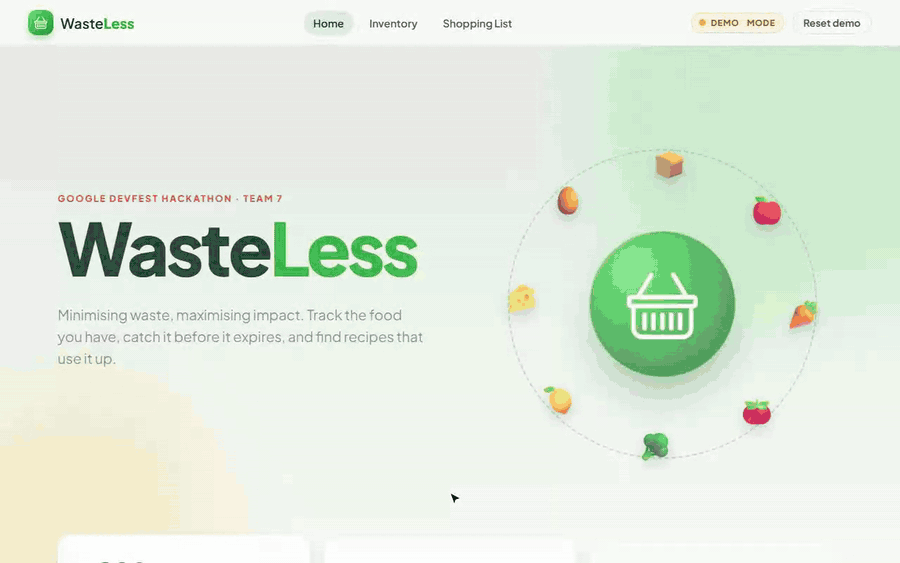
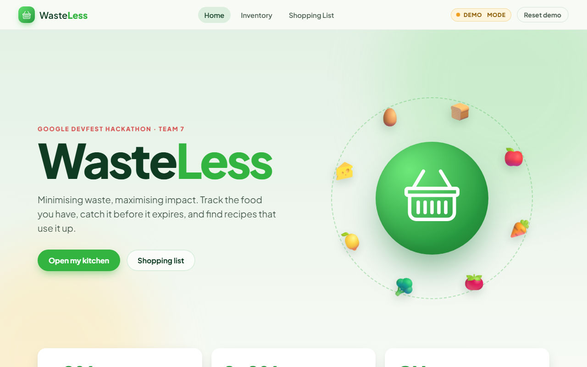
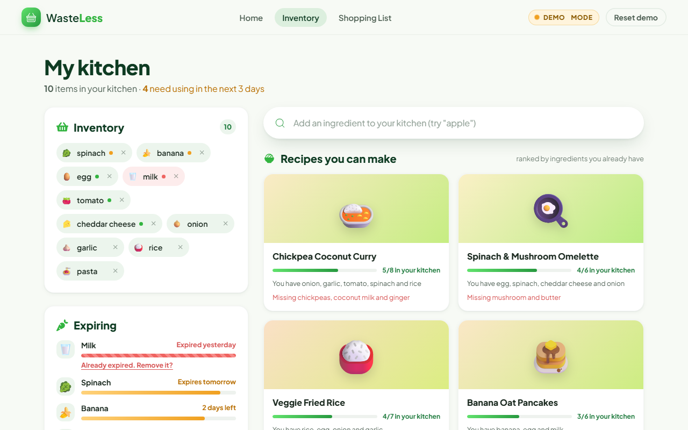
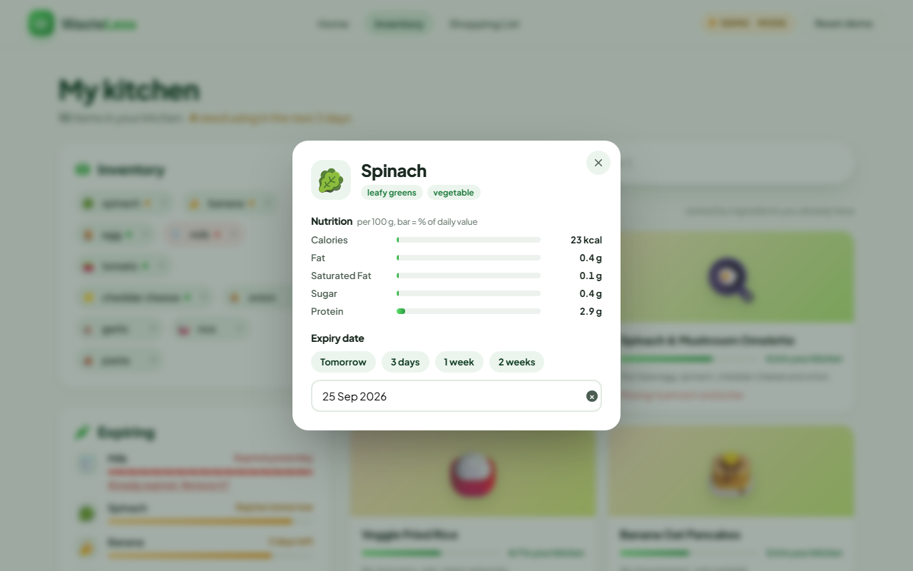
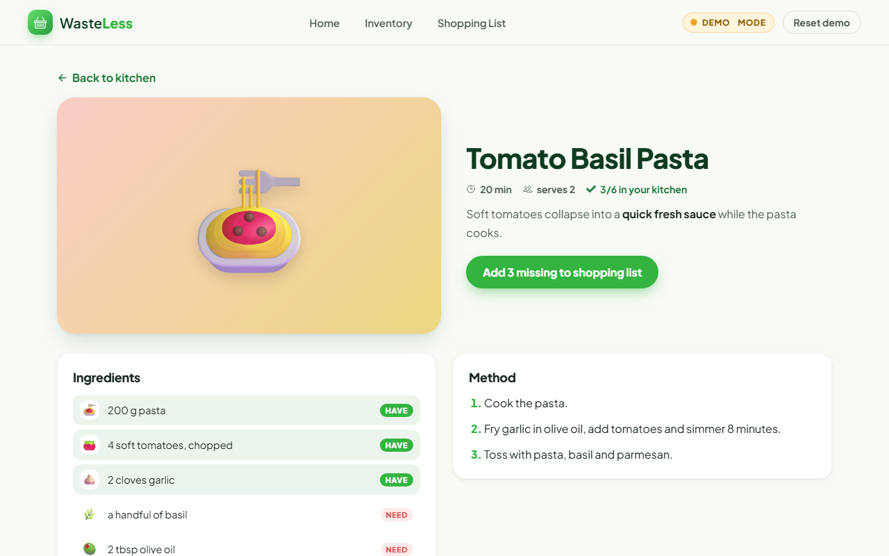
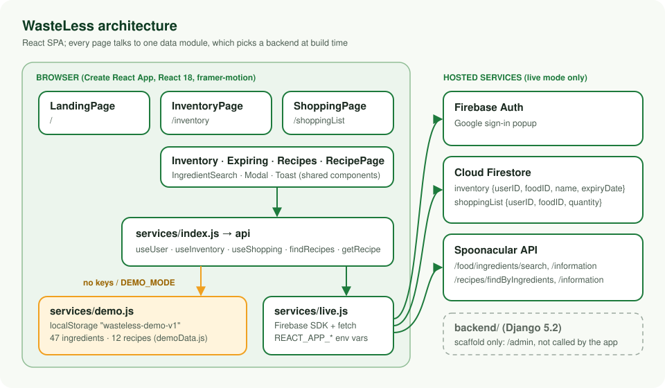
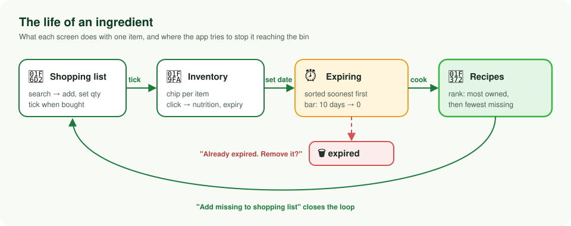

# WasteLess

**Live demo:** https://food-waste-management-rho.vercel.app (demo mode, sample data)

Track the food in your kitchen, catch it before it expires, and find recipes that use it up.
Built by Group 7 in four days at a Google DevFest hackathon, December 2023.



Team: Thomas, Deeni, Ameera and Aria. Commits by
[@duc-minh-droid](https://github.com/duc-minh-droid),
[@Aura4G](https://github.com/Aura4G),
[@deeniaffendi](https://github.com/deeniaffendi) and
[@ameeraarfaa](https://github.com/ameeraarfaa).

## What it does

Household food waste mostly happens quietly: something gets bought, pushed to the back of the fridge,
and thrown out a week later. In landfill it rots into methane. WasteLess is a small web app that tries to
interrupt that loop.

- **Inventory.** Search an ingredient and add it to your kitchen. Click any item to see its nutrition and
  set an expiry date (with one-click "tomorrow / 3 days / 1 week" shortcuts).
- **Expiring.** Items with a date are sorted soonest first, with a bar that drains as the date approaches.
  Expired items are flagged and can be removed in one click.
- **Recipes.** Suggestions are ranked by how many of your ingredients they use, then by how few you are
  missing. Each recipe page marks what you have and what you need, and can push the missing items onto
  your shopping list.
- **Shopping list.** Add items, adjust quantities, and tick them off in the shop. Ticking an item moves it
  into your inventory.

| Landing | Kitchen |
| --- | --- |
|  |  |
| **Ingredient details** | **Recipe** |
|  |  |

## Demo mode

The hackathon version needed a Firebase project (Google sign-in plus Firestore) and a Spoonacular API key
for every screen. To make it runnable and deployable without either, the app now has a **demo mode**:

- It switches on automatically when the Firebase and Spoonacular variables are not set, or when
  `REACT_APP_DEMO_MODE=true`.
- A "Demo mode" badge is always visible in the navbar, and the login button becomes "Reset demo".
- Data is stored in your browser's `localStorage` and seeded with a sample kitchen (one item already
  expired, a few about to).
- Ingredient search, nutrition and recipes come from canned sample data in
  [`frontend/src/services/demoData.js`](frontend/src/services/demoData.js): 47 ingredients with rough
  per-100 g nutrition and 12 recipes written for the demo. They are illustrative, not Spoonacular data.

With real credentials, the same UI talks to Firebase and Spoonacular exactly as it did at the hackathon.

## How it works



Every component goes through one module, [`services/index.js`](frontend/src/services/index.js), which
exports `api` plus a few hooks (`useUser`, `useInventory`, `useShopping`). Which backend `api` points at is
decided once, at build time:

- [`services/live.js`](frontend/src/services/live.js) is the original data flow moved out of the
  components: Firestore collections `inventory` and `shoppingList`, each document tagged with the
  signed-in user's `userID`, plus Spoonacular for search, nutrition and recipes.
- [`services/demo.js`](frontend/src/services/demo.js) implements the same interface over an in-memory
  store persisted to `localStorage`, with small artificial delays so loading states still show.

The recipe ranking in demo mode mirrors Spoonacular's `findByIngredients?ranking=1`: count how many recipe
ingredients are in your inventory, sort by that descending, then by missing count ascending.



The `backend/` folder is a Django project generated on day one and never wired up; the app talks to
Firebase directly. It is kept for the record and still runs (`/admin` only).

## Quick start

Requires Node 18+ (tested on Node 24).

```bash
cd frontend
npm install
npm start          # http://localhost:8124, demo mode
```

Production build (this is what Vercel runs):

```bash
cd frontend
npm run build      # static output in frontend/build
```

### Live mode

Copy `frontend/.env.example` to `frontend/.env.local` and fill in a Firebase web config and a Spoonacular
key. Enable Google sign-in in Firebase Auth and create a Firestore database. Note that every
`REACT_APP_*` value ends up in the public JavaScript bundle, so restrict the Firebase key to your domain
and treat the Spoonacular key as public (a proxy would be the proper fix).

### Backend (optional, unused by the app)

```bash
cd backend
python -m venv .venv && .venv/Scripts/activate   # or: source .venv/bin/activate
pip install -r requirements.txt
python manage.py runserver 8125
```

Set `DJANGO_SECRET_KEY` for anything beyond local use.

### Deploying on Vercel

| Setting | Value |
| --- | --- |
| Root directory | `frontend` |
| Framework preset | Create React App |
| Build command | `npm run build` |
| Output directory | `build` |
| Environment variables | none for demo mode; the `REACT_APP_*` set from `.env.example` for live mode |

`frontend/vercel.json` rewrites all paths to `index.html` so deep links such as `/inventory/1003` work.
The original Netlify deployment (<https://gregarious-puppy-922937.netlify.app>) still loads but is the
December 2023 build.

## Project layout

```
backend/                     Django scaffold (admin route only)
docs/media/                  demo recording, screenshots, diagrams
frontend/
  public/                    index.html, favicon, manifest, Netlify _redirects
  src/
    services/                config, demo + live backends, demo data, hooks
    components/              IngredientSearch, Modal, Toast, Thumb
    LandingPage/             hero, stats, feature cards
    InventoryPage/           Inventory, ExpiringIngredients, Recipes, RecipePage
    ShoppingPage/            SearchBar, ShoppingTable, ShoppingRow
    NavBar/                  nav links, demo badge, login / reset
  vercel.json                SPA rewrite for Vercel
```

## What was built at the hackathon, and what changed since

In the four days the team built the React frontend with Google sign-in, Firestore-backed inventory and
shopping list, Spoonacular ingredient search and recipe suggestions, and a Django project that ended up
unused. The "Monitor" feature (tracking your impact over time) was planned but not started.

The later polish pass kept the same pages, routes, Firestore schema and component layout, and:

- moved all Firebase / Spoonacular calls into `services/` and added demo mode;
- redesigned the UI (layout, typography, colour system) and added animation: page transitions, orbiting
  hero, count-up stats, chips that pop in and out, animated nutrition and expiry bars, drawn checkmarks,
  toasts;
- fixed bugs: ingredient search queried the previous keystroke; expired items never showed the delete
  prompt (status was compared against `" - Expired"`); the ingredient modal added a new document listener
  on every render; the expiring query needed a Firestore composite index that did not exist; recipes showed
  "no recipe yet" while still loading; the 404 route was invalid for React Router 6; shopping rows read
  `auth.currentUser.uid` before sign-in had resolved;
- moved the Firebase config and Django secret out of the source into environment variables;
- updated React to 18.3.1, React Router to 6.30.6 and Firebase to 10.14.1 (latest patches in their
  majors), removed five unused dependencies, and moved the Django pin to 5.2 LTS.

Still open: a real "Monitor" page, a server-side proxy for the Spoonacular key, Firestore security rules in
the repo, and replacing Create React App (unmaintained) with Vite.

## Licence

No licence file has been committed. The original README mentioned BSD 3-Clause; ask the authors before
reusing the code.
